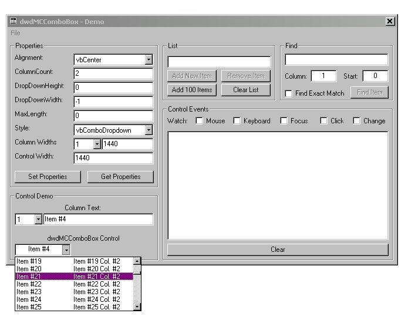



## Great & Simple Multi\-Column ComboBox

### Description

Yet another update. I have fixed the scrollbar display under WindowsXP.

Here's an update to my Combobox control. I fixed the App activation issue, and added support for MDI & MDI child forms.

Thanks for the support!

Due to the lack in VB for a Multi-Column Combobox and the licensing issues with the Forms2.0 control, I've created my own. This control uses only the standard VB controls so there are no extra dependencies like many of the other Multi-Column comboboxes out there. It's simple to use and setup. It supports column widths, a finditem method that searches items by column, and hot-tracking. It also has the common ComboEdit & ComboList style. You can adjust the drop-down list height and width. The list will also display outside of the form border. The code for the control is not commented very well, but the demo does a pretty good job explaining how to use it. Many of the API & Subclassing base techniques used in the control are from vbAccelerator, & mvps.org/vbnet. Also, if you know of any ways to improve it, please let me know. I've tested MANY other Multi-Column comboboxes (free and the not so free) and I feel this control is a very good cross between graphical representation and useability providing the programer an easy interface and the end user a control that behaves like you would expect.

If you feel that this control is worth the time & effort put into it, then please vote for it! If not, any suggestions on how I can make it better are greatly appreciated. Thanks
 
### More Info
 

             |
---                |---
**Submitted On**   |2002-04-08 07:07:58
**By**             |[Matthew Hood](https://github.com/Planet-Source-Code/PSCIndex/blob/master/ByAuthor/matthew-hood.md)
**Level**          |Advanced
**User Rating**    |4.6 (73 globes from 16 users)
**Compatibility**  |VB 6\.0, VBA MS Access
**Category**       |[Custom Controls/ Forms/  Menus](https://github.com/Planet-Source-Code/PSCIndex/blob/master/ByCategory/custom-controls-forms-menus__1-4.md)
**World**          |[Visual Basic](https://github.com/Planet-Source-Code/PSCIndex/blob/master/ByWorld/visual-basic.md)
**Archive File**   |[Great\_&\_Si70055482002\.zip](https://github.com/Planet-Source-Code/matthew-hood-great-simple-multi-column-combobox__1-26216/archive/master.zip)

